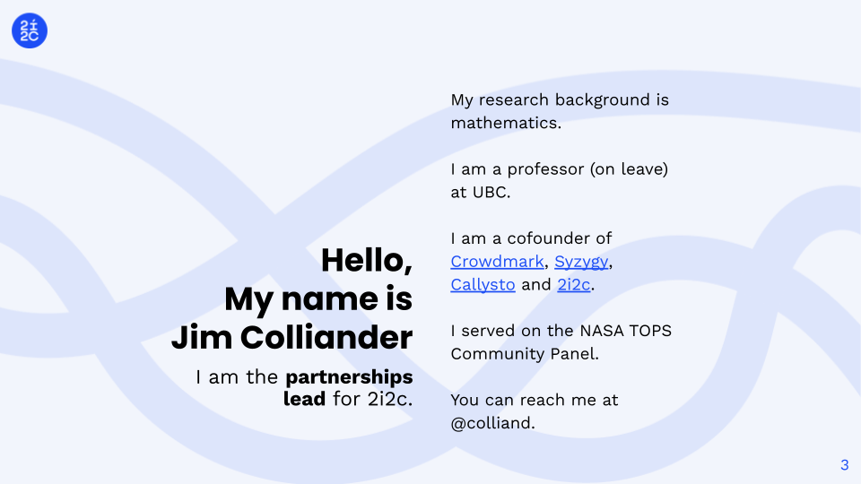
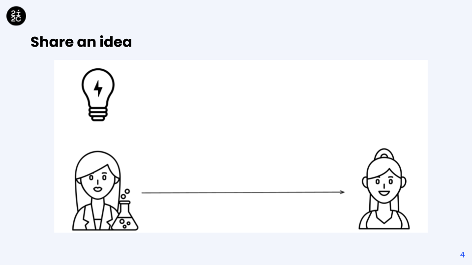
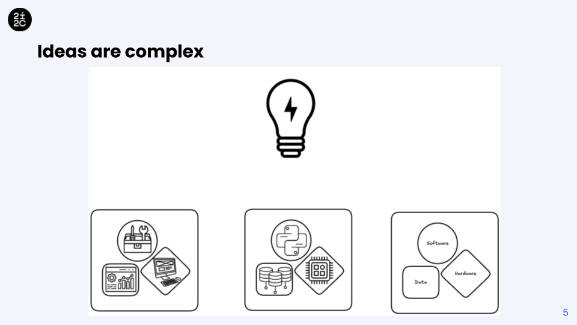
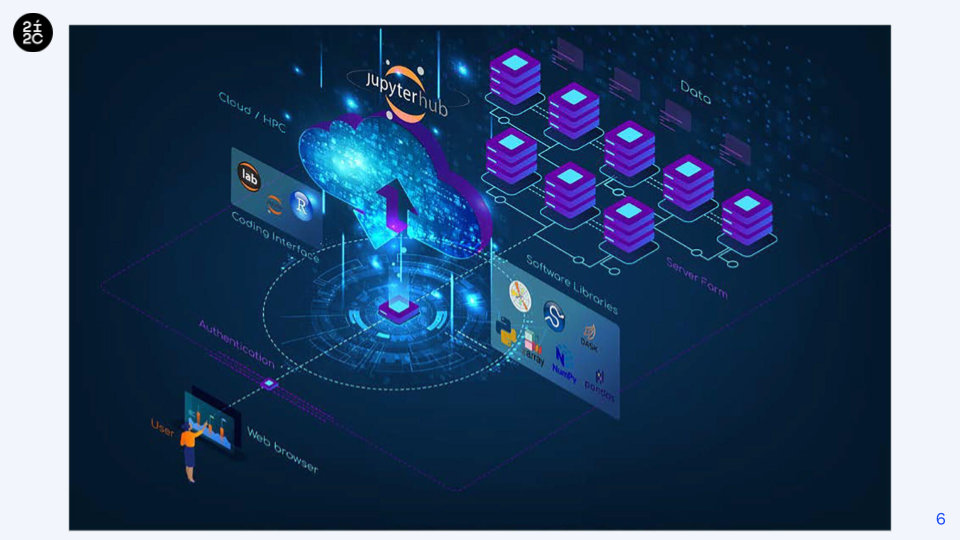
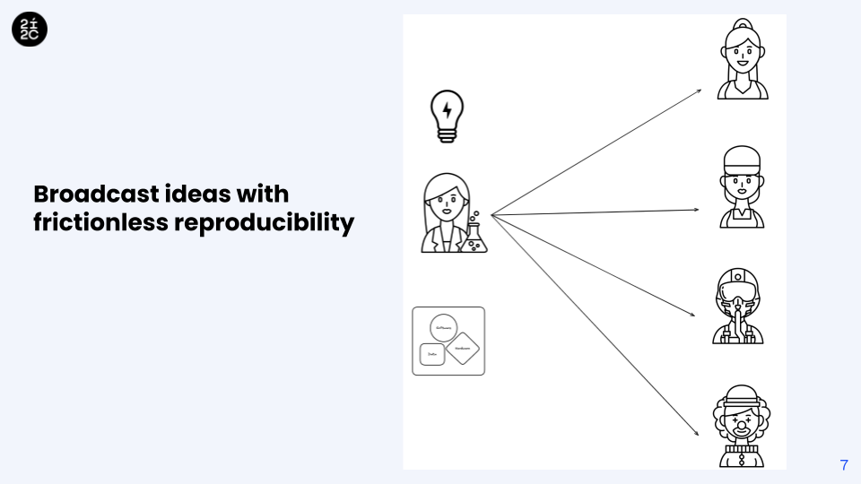
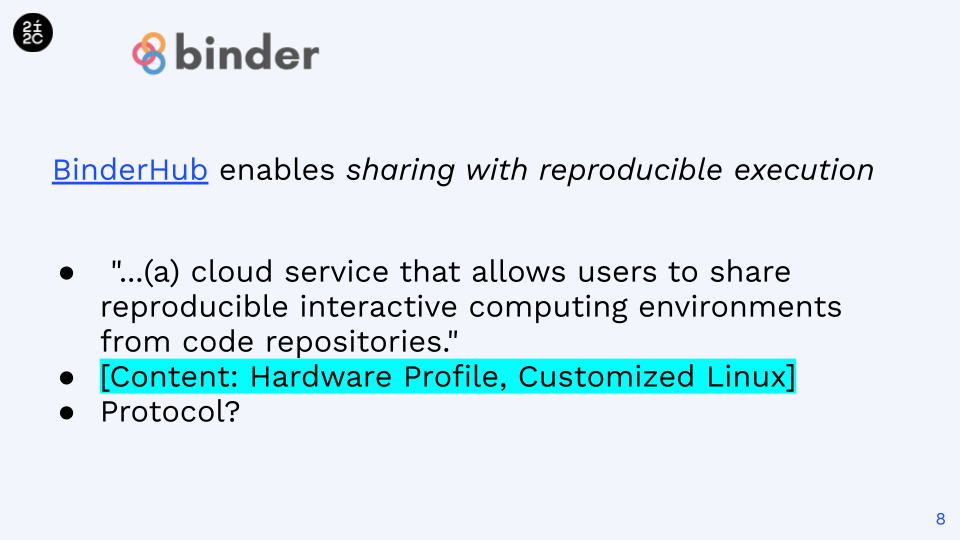
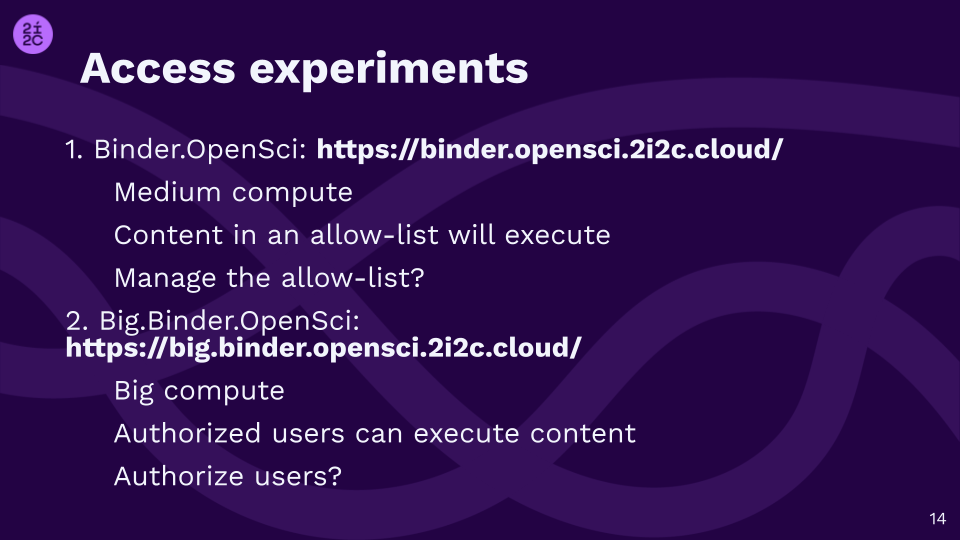
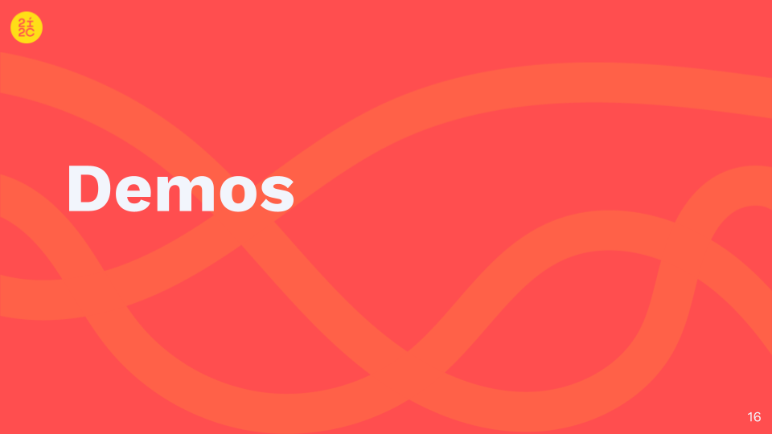
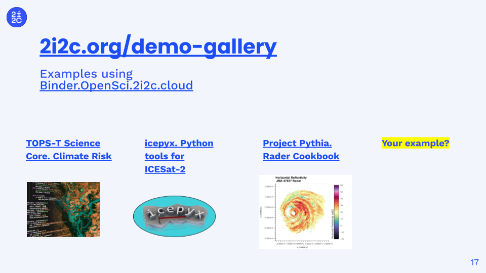

---
jupytext:
  text_representation:
    extension: .md
    format_name: myst
    format_version: 0.13
    jupytext_version: 1.16.4
kernelspec:
  display_name: Python 3 (ipykernel)
  language: python
  name: python3
---

+++ {"editable": true, "jupyterlab-deck": {"layer": "deck"}, "slideshow": {"slide_type": "slide"}}

+++ {"editable": true, "jupyterlab-deck": {"layer": null}, "slideshow": {"slide_type": "slide"}}

+++ {"editable": true, "slideshow": {"slide_type": "slide"}}

+++ {"editable": true, "slideshow": {"slide_type": "slide"}}

+++ {"editable": true, "slideshow": {"slide_type": "slide"}}

+++ {"editable": true, "slideshow": {"slide_type": "slide"}}

+++ {"editable": true, "slideshow": {"slide_type": "slide"}}

+++ {"editable": true, "slideshow": {"slide_type": "slide"}}

+++ {"editable": true, "slideshow": {"slide_type": "slide"}}

+++ {"editable": true, "slideshow": {"slide_type": "slide"}}

+++ {"editable": true, "slideshow": {"slide_type": "slide"}}

+++ {"editable": true, "slideshow": {"slide_type": "slide"}}

+++ {"editable": true, "slideshow": {"slide_type": "slide"}}

+++ {"editable": true, "slideshow": {"slide_type": "slide"}}

+++ {"editable": true, "slideshow": {"slide_type": "slide"}}

+++ {"editable": true, "slideshow": {"slide_type": "slide"}}

