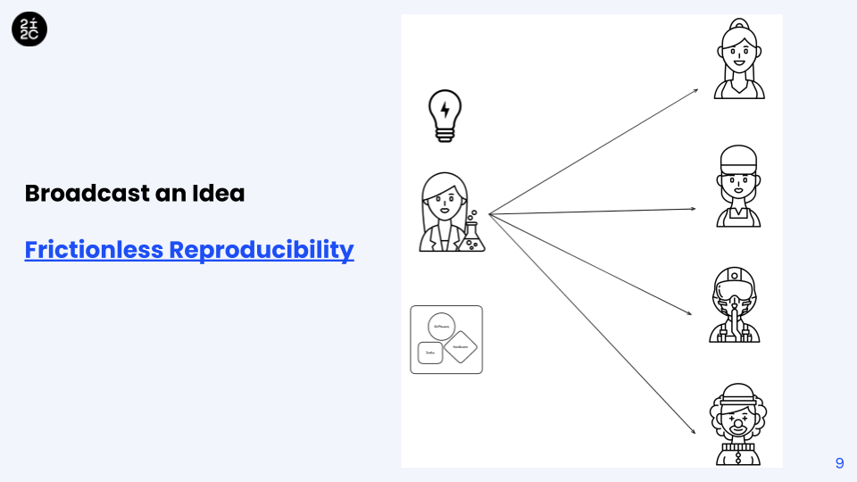

---
jupytext:
  text_representation:
    extension: .md
    format_name: myst
    format_version: 0.13
    jupytext_version: 1.16.4
kernelspec:
  display_name: Python 3 (ipykernel)
  language: python
  name: python3
---

<iframe src="https://docs.google.com/presentation/d/e/2PACX-1vQCsoAM5ogL36qMaDS5MpsuffXhZBomBhrlbvP_h2GV4fnfQ5nOQRkZcJUbGL-7H76UeB5Hhr2m80iB/embed?start=false&loop=false&delayms=3000" frameborder="0" width="960" height="569" allowfullscreen="true" mozallowfullscreen="true" webkitallowfullscreen="true"></iframe>

+++


+++

## Slides 

Click the power button to launch Binder.OpenSci in the background. 

The click the play button to render the embedded slides.

The slides can also be accessed by [clicking here](https://docs.google.com/presentation/d/1puDRIrvx2yFMtHPyFNoIuZ_3QQjuPDZwg1RutOe5FXc/edit?usp=sharing).

```{code-cell} ipython3
%%html
<iframe src="https://docs.google.com/presentation/d/e/2PACX-1vQCsoAM5ogL36qMaDS5MpsuffXhZBomBhrlbvP_h2GV4fnfQ5nOQRkZcJUbGL-7H76UeB5Hhr2m80iB/embed?start=false&loop=false&delayms=3000" frameborder="0" width="800" height="450" allowfullscreen="true" mozallowfullscreen="true" webkitallowfullscreen="true"></iframe>
```



```{code-cell} ipython3

```
